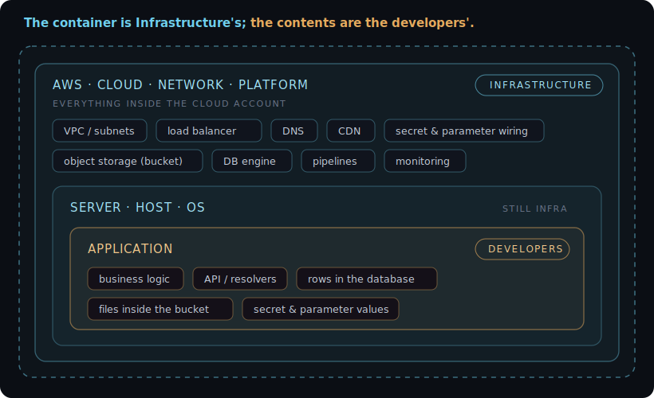

# engineering-os

[](https://tanya-ok.github.io/engineering-os/)
[](https://github.com/tanya-ok/engineering-os/actions/workflows/ci.yml)
[](LICENSE)

A personal OS for cloud and infrastructure engineers: your notes as a queryable
knowledge base, wired into AI coding agents.

**[Documentation](https://tanya-ok.github.io/engineering-os/)** - quickstart, concepts, and the RAG API.

**What you get from one clone:**

- An Obsidian vault template scaffolded for the five domains an infra engineer
  actually works in: **CloudOps, FinOps, DevOps, SecOps, Architecture**.
- A local **hybrid RAG index** over your vault: SQLite + sqlite-vec + FTS5,
  vector search fused with BM25, optional MMR reranking. A small TypeScript
  service, no Python, no PyTorch, no cloud. Your notes never leave your machine.
- An HTTP search server your AI agent (Claude Code or any MCP-capable client)
  can query for grounded context.
- ADR scaffolding, weekly review structure, and an index layer
  (`_Index/Vault Map`, `Active Context`, `Open Loops`) designed to be loaded
  into an agent session as working context.

## The one rule to remember

The line that settles every infra-versus-app argument: infrastructure owns the
container, developers own the contents.

<p align="center">
  <a href="https://tanya-ok.github.io/engineering-os/boundary/">
    
  </a>
</p>

The database engine is infra; the rows are the app's. The bucket is infra; the
files in it are the app's. [More on the boundary](https://tanya-ok.github.io/engineering-os/boundary/).

## Quickstart (15 minutes)

```sh
git clone https://github.com/YOUR_USER/engineering-os.git
cd engineering-os
./scripts/setup.sh          # checks node + pnpm, builds rag/, copies example configs

# index the shipped vault templates (or point at your own vaults)
node rag/dist/cli.js index --config rag/vaults.json

# start the search server (port via --port or EOS_SERVER_PORT, default 8765)
node rag/dist/cli.js serve --config rag/vaults.json

# query it
curl -s -X POST http://127.0.0.1:8765/search \
  -H 'Content-Type: application/json' \
  -d '{"query": "how do I record an architecture decision", "top": 5, "hybrid": true}'
```

Then open `vault-template/` in Obsidian and make it yours.

## How it works

```
three markdown vaults      =  the database
  vault-template/          =  work knowledge (five domains)
  ai-vault-template/       =  the agent's self-knowledge + interaction rules
  user-vault-template/     =  you: communication style, environment, facts
        |
        v
eos-rag index              =  chunk + embed + store (incremental, mtime-based)
        |
        v
~/.engineering-os/index.db =  SQLite: chunks + vec0 embeddings + FTS5
        |
        v
eos-rag serve (:8765)      =  POST /search  (vector kNN + BM25 via RRF, MMR)
        |
        v
your AI agent              =  grounded answers from all three vaults
```

The RAG layer is a TypeScript package (`eos-rag`): embedding runs through
[transformers.js](https://github.com/huggingface/transformers.js) (ONNX,
quantized weights) and storage is SQLite via
[sqlite-vec](https://github.com/asg017/sqlite-vec) plus FTS5. No Python
runtime, no PyTorch. Vault paths are guarded by a diode rule: they must sit
under the config's `allowed_roots`, and iCloud paths are always refused, so a
work-side index can never ingest personal data.

**Reading is unified, writing is segregated.** All three vaults are indexed
into one database, so an agent retrieves across your work knowledge, its own
memory, and your user model at once. Writing is governed by a routing contract
(`rag/routing.json`): agent self-knowledge goes to the AI vault, durable facts
about you are staged in the user vault, operational work lands in the work
vault's domains. The vaults stay plain markdown, editable in Obsidian.

## The three vaults

| Vault | Holds | Why it exists |
|---|---|---|
| **work** (`vault-template/`) | Runbooks, cost reviews, pipelines, controls, ADRs | Your infrastructure knowledge, split into five domains |
| **ai** (`ai-vault-template/`) | The agent's identity, learned interaction rules, observations | So a correction you give once survives to the next session |
| **user** (`user-vault-template/`) | Your communication style, local environment, stable facts | So the agent matches you instead of guessing |

## The standards layer

`standards/` is the governance layer, kept separate from the vaults: canonical
policy modules, the skills and hooks that operationalize them, and a plugin
manifest that makes the whole thing installable. It is structured so it can be
extracted into its own plugin repo later. See `standards/README.md`.

## The five domains

| Domain | What lives there |
|---|---|
| `CloudOps/` | Cloud infrastructure, networking, monitoring, runbooks |
| `FinOps/` | Cost reviews, tagging policy, budget alerts, savings plans |
| `DevOps/` | CI/CD pipelines, release flows, deployment automation |
| `SecOps/` | Security controls, compliance notes, secret rotation, audits |
| `Architecture/` | ADRs (`decisions/`), contracts, capacity planning |

Each domain folder ships with a README describing its conventions and one
example note showing the expected shape.

## Requirements

- Node.js 24 (active LTS) and pnpm.
- Obsidian (optional but recommended)

The first index run downloads the embedding model
(`intfloat/multilingual-e5-small`, quantized, ~120 MB); it is cached under
`~/.engineering-os/models`. The default is multilingual (RU/EN cross-lingual
retrieval works out of the box); `rag/vaults.json` can swap it for
`all-MiniLM-L6-v2` or a larger `multilingual-e5-*`.

## Roadmap

- v0.1: vault template + local RAG layer (this)
- v0.2: Claude Code skills and hooks (session context loader, weekly review, ADR scaffolder)
- v0.3: beads task-graph integration for agent work tracking
- v0.4: docs site (MkDocs Material, GitHub Pages)

## License

MIT. See [LICENSE](LICENSE).
